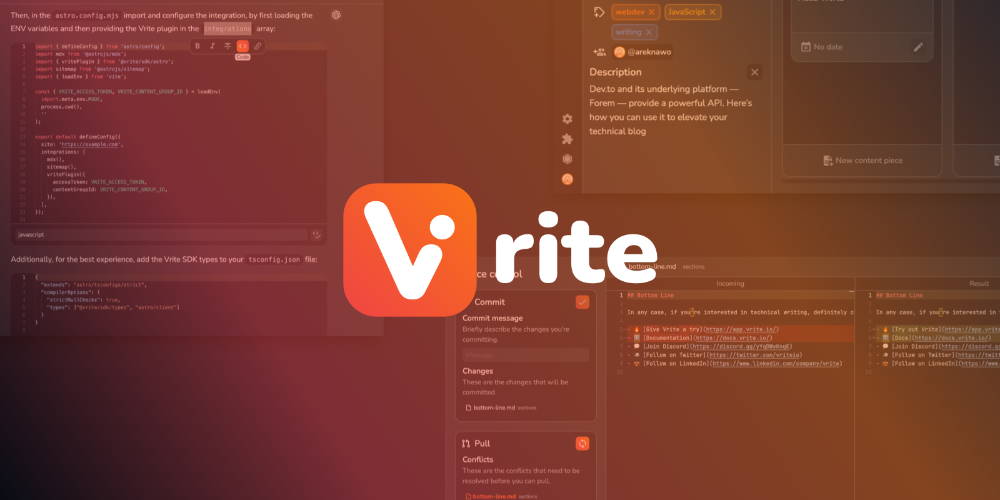

    
    <h1 align="center">Open-source, collaborative developer content platform</h1>

<h4 align="center">
  <a href="https://docs.vrite.io">Usage Guide</a> |
  <a href="https://vrite.io">Website</a> |
  <a href="https://app.vrite.io">Vrite Cloud</a>
</h4>

  
  
  

Vrite is an open-source, collaborative space to create, manage and deploy product documentation, technical blogs, and knowledge bases. It aims to provide a high-quality, integrated user and developer experience, with features like:

- **Built-in managment dashboard** for managing content production and delivery using Kanban or List view;
- Modern **WYSIWYG** editing experience with support for **Markdown**, integrated **code editor**, code formatting and real-time collaboration;
- AI-powered **semantic search** for organizing and searching through your content base;
- Versitile **API** and **Extension System** for customizing your experience and delivering content to any frontend;
- **Open-source**, with options to both self-host and use [Vrite Cloud](https://app.vrite.io).

Learn more about all features of Vrite and how to use them from the [official Usage Guide](https://docs.vrite.io).

> **Try out:** A simple version of Vrite Editor is available without sign-in at [editor.vrite.io](https://editor.vrite.io). Full Vrite experience available at [app.vrite.io](https://app.vrite.io).

## Links

- 🔥 [**Try out Vrite**](https://app.vrite.io)
- ℹ️ [**Usage guide**](https://docs.vrite.io)
- 🚀 [**Blog**](https://vrite.io/blog)
- 📝 [**Report a bug**](https://github.com/vriteio/vrite/issues)
- 🙋‍♀️ [**Request a feature**](https://github.com/vriteio/vrite/discussions)
- 💬 [**Join Discord**](https://discord.gg/yYqDWyKnqE)
- 🐦 [**Follow on Twitter**](https://twitter.com/vriteio)
- 💼 [**Follow on LinkedIn**](https://www.linkedin.com/company/vrite)

## License

Licensed under the [AGPL-3.0 License](https://github.com/vriteio/vrite/blob/main/LICENSE).
